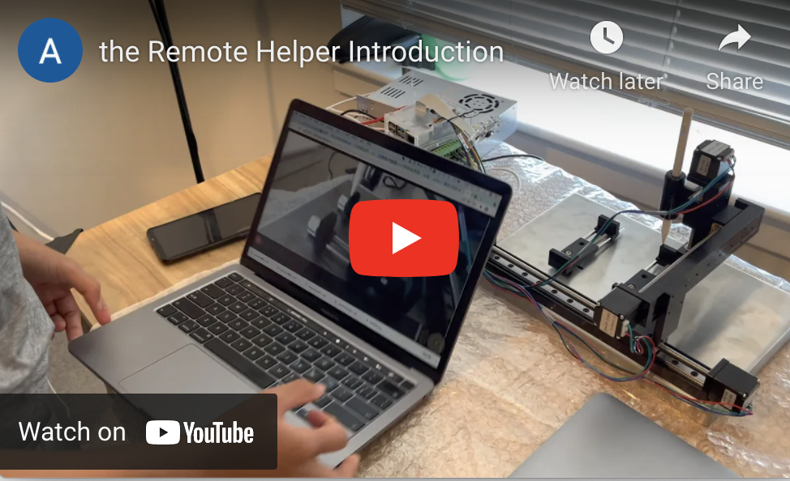
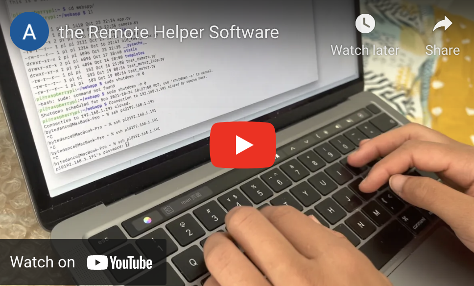
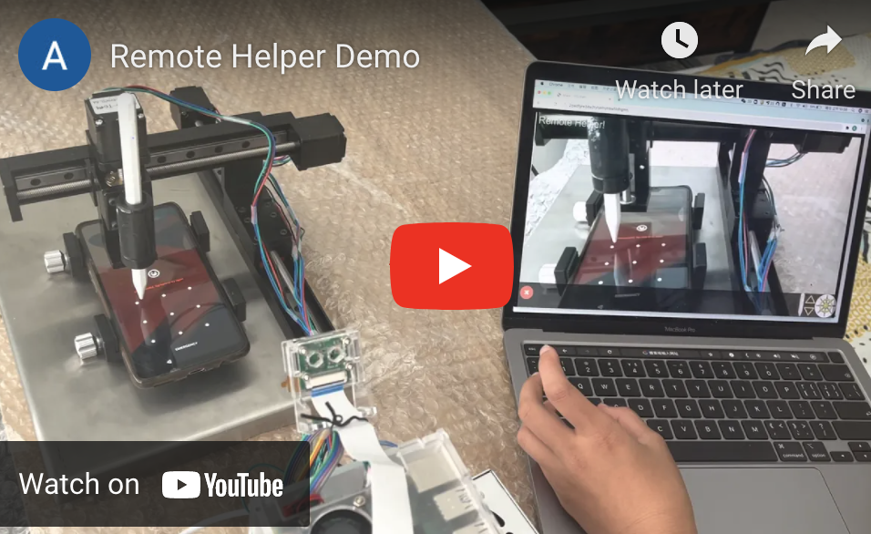

# About Ashley Yu

**This is my regularly updated personal website.**

## Interests and Hobbies
### Athletics 
 - Squash
   - US Squash Rating 2.76
   - 12 hours every week
   - 2 years experience
   - Club member
 - Soccer
   - 8 hours every week
   - Playing Soccer since first grade
   - Co-captain of school JV team
 - Basketball
   - Playing Basketball since first grade
 - Lacrosse
   - Playing Lacrosse in spring semester at Fay in 2021
 
### Computing
 - Robotics
   - 2 years experiences
 - Python
   - 2 years experience
 - Java
   - 1 year experience(Learning at Fay school)
 - HTML
   - 1 year experience
 - Project
   - Created a device that holds a touch-screen that is able to be controled remotely
     - Helps the people with technological difficulties
     - Especially the elderly like my grandma
   - Used Raspberry
   - Used CAD (Computer Aided Design)
   - Used HTML

### Debate
  - VBI summer camp(2021)
  - MUN summer camp(2020)
  - Debate clubs(2019-2021)

### Music
 - Piano 
   - 3 years experience
 - Drums
   - 1 year experience
- Bells
   - Bells Program at Fay School

### VisualPerformingArts - Painting and Drawing
 - Private lessons
 - 2 hours per week

### CommunityService - Community service 
 - member of community connection leadership(2021) Help organize community connection events at Fay School
 - Donating N95 masks to New York Hospitals (2020)
 - Giving tree (2018-2019)  Buying toys, books, and clothes, and then giving them to the children in need.
 - MMC (2018) Takes pictures and videos for the school.
 
## Achievement
### Squash Tournaments
 - Nick Talor Academy Summer Junior Silver 2nd place, 2021
 - New England Regional Junior Championships 3rd place, 2021
 - Emerson Hospital Squashfit Silver 3rd place, 2021
 - Abacus Finance Boston Junior Grand Prix #6 2nd place, 2021

### Basketball
 - Ball Tour Winter League, 2nd place (2017)

### Lacrosse
 - Best Effort Reward of Lacrosse team at Fay School

### Computing
 - USACO (USA Computer Olympiad) Silver Level
 - International Junior Botball Challenge and won third place with my teammates
 

## Smart Device Remote Helper
**more to come**

  Introduction 
  

  Software 
  

  Demo 
  

 

## Squash
<a href="https://clublocker.com/users/381484/home">My home page at USA squash</a> 
**more to come...**

